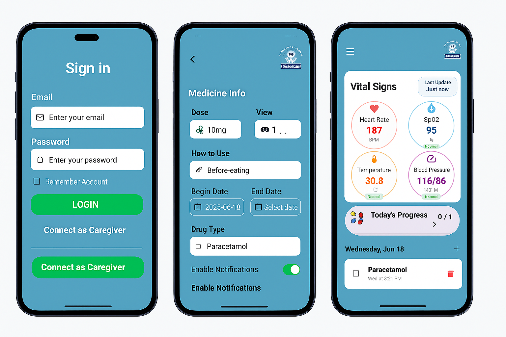
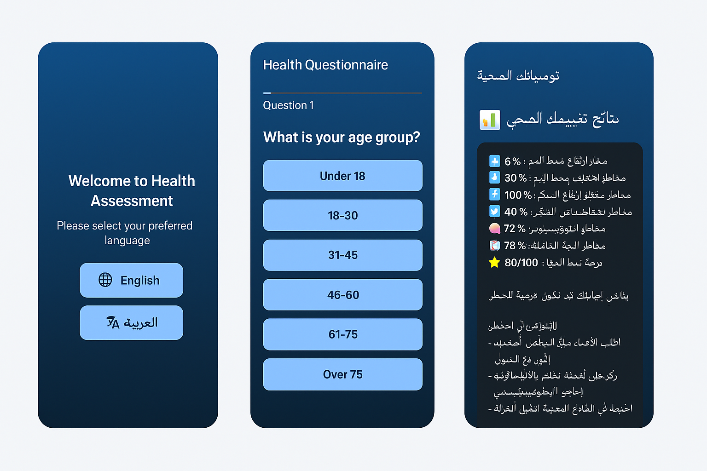
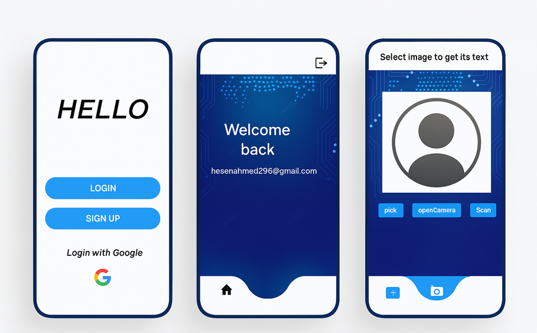
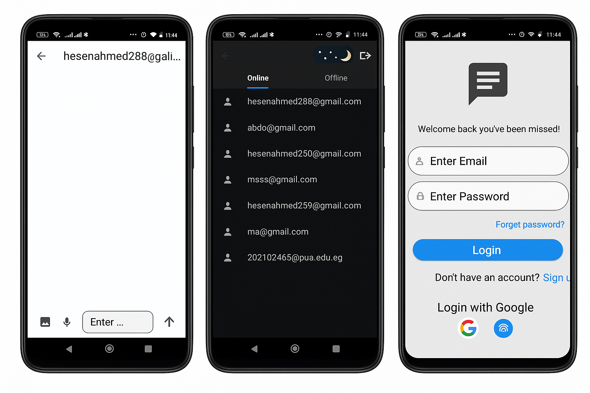
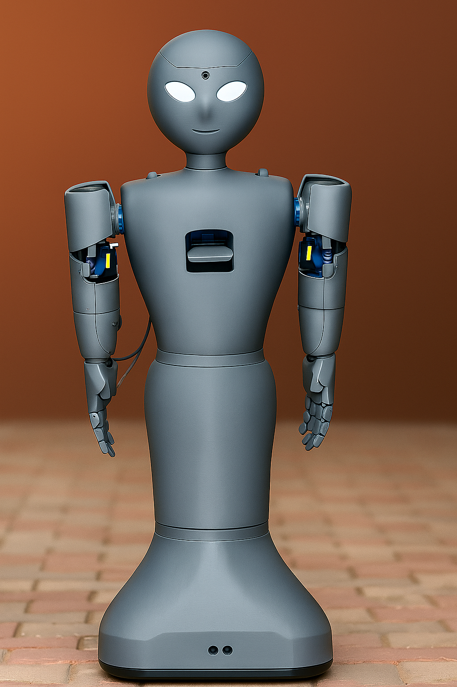

# Abdelrahman Elkomy – Project Demos
This repository contains demo videos of my AI, robotics, and mobile development projects.

# Medical-Assistant-Robot-App

[Watch Demo Video](https://drive.google.com/file/d/1tkjuqnhea_Bi2chiDE6_skczZOB0wYT6/view?usp=drive_link)
Healtron – Smart Medical Assistant UI A sleek mobile interface designed for healthcare tracking. Includes a secure login, 
medication management with reminders, and real-time vitals monitoring — all in a clean, user-friendly design focused on patient ease and clarity.
Voice-based robot delivers medicines using NLP and automation. Mobile app tracks sensor data, vital signs, and personalized medication schedules.

---

# Health Recommendation App

[Watch Demo Video](https://drive.google.com/file/d/1qL-VLt4AwqhqMSNikt3eg_ELDRW_2TB-/view?usp=sharing)
This mobile app uses intelligent, adaptive questionnaires based on medical research to assess your risk of high blood pressure and diabetes. By analyzing user inputs 
like lifestyle, symptoms, and history, it provides personalized health insights and early warnings—empowering preventive care without needing physical tests.

---

# OCR Scanner App

[Watch Demo Video](https://drive.google.com/file/d/1JcVddVykNBbyyH2KZ5UK_l2chPby3AXQ/view?usp=sharing)
converts handwritten notes into fully searchable PDF documents using Python and OCR technology. It processes scanned images or photos of handwritten pages, 
cleans them using image processing techniques, extracts the text with Tesseract OCR, and generates searchable PDF files. This is especially useful for digitizing lecture notes,
meeting summaries, or paper records.
I developed a mobile OCR (Optical Character Recognition) application using Flutter and Tesseract OCR that extracts text from images in English. Users can capture images via camera 
or upload from the gallery, and the app processes the image to detect and extract the printed text accurately.
Converts handwritten notes into searchable PDFs using Python, OpenCV, and Tesseract OCR. Automates image cleanup, text extraction, and PDF generation.

---

# Tawasol Chat App

[Watch Demo Video](https://drive.google.com/file/d/1ebKvLc7duK8uLUTLNvBigswaNTwXDs81/view?usp=sharing)
Twasol is a mobile chat app for fast and secure communication. It’s designed with a clean, modern look and smooth user experience. Main Features:
Easy login (Email, Google, Fingerprint),Organized contact list (online/offline),Simple and clean chat interface,Light and dark mode,
Mobile-friendly design,Perfect for users who want quick, easy, and stylish messaging.
Flutter & Firebase chat app with login, text/image/voice messages, online status, seen/unseen message indicators, and real-time cloud sync.

---

# Medical Assistant Robot

[Watch Demo Video](https://drive.google.com/file/d/1tkjuqnhea_Bi2chiDE6_skczZOB0wYT6/view?usp=sharing)
Voice-based system using NLP to assist patients and physically deliver medicines at scheduled times.
And have mobile app medical assistant I publish it and with another app uses intelligent, adaptive questionnaires based on medical research to assess your risk of high blood pressure and diabetes. By analyzing user inputs like lifestyle, symptoms, and history, it provides personalized health insights and early warnings—empowering preventive care without needing physical tests.

---

# Banking System
[Watch Demo Video](https://drive.google.com/file/d/1jo-AJgWOx1AS8R2IwVGS3tvfQZd7KFmr/view?usp=sharing)
A modern web-based banking application for managing accounts, transactions, and loans. It features:
Account creation and editing
Deposit, withdrawal, and transfer functionalities
Loan application and payment system
Bug tracking dashboard
Automated and data-driven testing using Katalon Studio
Performance analysis and metrics display
This system simulates real-world banking workflows and supports robust testing and learning experiences.

---

# Unity AR App
[Watch Demo Video](https://drive.google.com/file/d/1MX1kOKQfE_m-3e9UZ4AodqXZArbyVWa5/view?usp=sharing)
Shows a 3D model using Unity when scanning a target image.

---

Source code is private. Available upon request.
