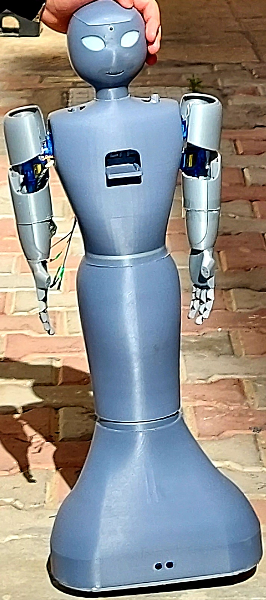

# Abdelrahman Elkomy – Project Demos
This repository contains demo videos of my AI, robotics, and mobile development projects.

---

# Medical Assistant Robot

[Watch Demo Video on Google Drive](https://drive.google.com/file/d/1tkjuqnhea_Bi2chiDE6_skczZOB0wYT6/view?usp=sharing)
A voice-based robot that delivers medicines using NLP and automation.

---

# Health Recommendation App
[Watch Demo Video](https://drive.google.com/file/d/1qL-VLt4AwqhqMSNikt3eg_ELDRW_2TB-/view?usp=sharing)
An app that predicts blood pressure and sugar risk using smart questionnaires.

---

# OCR Scanner App
[Watch Demo Video](https://drive.google.com/file/d/1JcVddVykNBbyyH2KZ5UK_l2chPby3AXQ/view?usp=sharing)
Converts handwritten notes into searchable PDFs using Python OCR.

---

# Tawasol Chat App
[Watch Demo Video](https://drive.google.com/file/d/1ebKvLc7duK8uLUTLNvBigswaNTwXDs81/view?usp=sharing)
Real-time chat app like WhatsApp using Flutter and Firebase.

---

# Unity AR App
[Watch Demo Video](https://drive.google.com/file/d/1MX1kOKQfE_m-3e9UZ4AodqXZArbyVWa5/view?usp=sharing)
Shows a 3D model using Unity when scanning a target image.

---

Source code is private. Available upon request.
